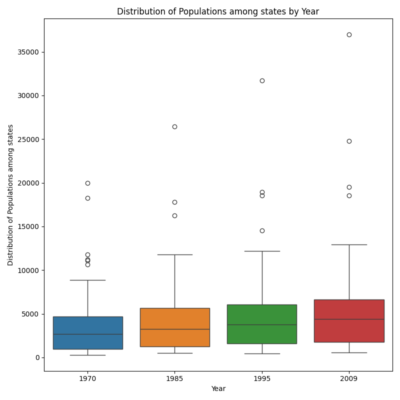
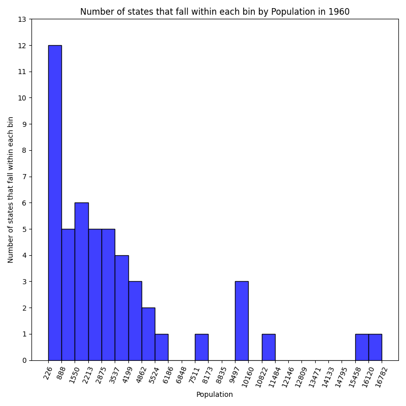
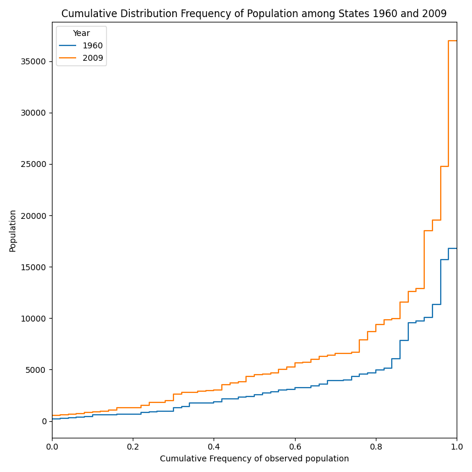

## Dakota Scott
## CS625-HW5
## Due: 11/03/24

# Table 12 - Resident Population--States (pg. 18 in PDF)
## Chart 1
### boxplot: Show the distributions of the population of all states in 1970, 1985, 1995, and 2009 this should result in 4 separate boxplot glyphs in a single chart
  
[Link to Image](Distribution_of_Populations_among_states_Years-1970-1985-1995-2009.png)

In order to create this chart, I first needed to clean and refine the chart so that the data was usable and the headers were correct. I then refined this further by only selecting the populations in 1970, 1985, 1995, and 2009. This information is all that was necessary as each year was treated as a category. From there, standard box-plots were constructed in order to demonstrate the distribution of state populations over the years. This was created using the question1 method in hw5.py. This idiom was good for understanding the general trends, but not as good for understanding the trends for each state. In this exploration, it is clear that the majority of states will increase their population at a similar rate, while other states (outliers) will increase their population at a much faster rate, as noted by the extremity of the maximums. The use of colors was appropriate as these years are not being compared sequentially and thus a categorical colorscheme is appropriate. It is clear from this chart that all population statistics have increased as an aggregate (including the mean, max, min, and quartiles), though this may not be the case for all states.

## Chart 2
### histogram: Show the distribution of the population of all states in one of the years (your chart title must indicate which year) your histogram should use a reasonable bin size for the data
  
[Link to Image](Population_Histogram_in_1960.png)

From this chart, it is pretty clear that the majority of states in 1960 had populations under 6,200; with a few exceptions over 15,000. It also demonstrates that there are many bins in which there are no states. This further contributes to a dispersed non-gaussian curve. When deciding the number of bins, it seemed appropriate that the bin_number value be a factor of the total number, 10 was very crowded and was difficult to see compare the frequencies, and thus 25 was selected as it did not overly disperse the data, but also allowed for sufficient seperation and discriminability. From this it is clear that two states are much larger than all of the others in 1960. The advantages of this chart are that it allows for a broad view of the distribution of populations among the states, but it does not identify which states are the largest. i.e. I know that there are two much larger state populations, I do not know what states they correlate to. 

## Chart 3
### eCDF: Show the distributions of the population of all states in two of the years (your legend must indicate which years)
  
[Link to Image](Cumulative_Distribution_Frequency_of_Population_among_States_1960_and_2009.png)

From this chart, it is clear to see that the general distribution of population is very similar. The cdf curve of 1960 and the cdf curve of 2009 have very similar shapes. Due to this, it is likely that the distribution of people among certain states is consistently higher than the population of other states (California is always more populated than Rhode Island). Further, it should be noted that specific readings can be made. Almost half of the us population lives in the top 10% most populated states, and approximately 3/4 live in the top 20% most populated states. In this case, the data could have been normalized to present a pattern based on the relative sizes, however, due to the nature of demonstrating populations, it was a better choice to include the raw population numbers as it demonstrates the magnitude of change over the years. i.e. the year of 2009 being higher may make it more difficult to compare shape, but much easier to compare raw figures. 

# Part 2 Analysis
## Rate of change of population
### Bar Graph of average percentage change based on population counts Counting the 5 highest and lowest percentage changes.
.png)  
[Link to Image](Top_5_and_Bottom_5_States_by_Average_Population_Growth_Rate_(1960-Present).png)

In this image, I attempted to display the average rate of population growth throughout the samples. That is to say, on average, how much did the population of the state grow every time the population was surveyed. In order to accomplish this, I needed to take the data that had to do with the population measured at each point in time and keep a running tally of the percentage change as compared to the previous year, and then took the average of these. This is a more accurate way of determining the average growth rate, rather than taking the total growth and comparing it to the beginning as now each growth measurement is relative to the previous one. Without this, states that got bigger (not at a disproportionate rate) but at a much larger speed, would be seen as growing much more quickly than the others. This chart clearly shows that "Nevada, Arizona, Alaska, Florida, and Utah" were the top 5 states with the largest percentage growth since 1960 which makes sense as those states are out west, and have not been states for as long as the other states. 

## Greatest rate of change over time
While the previous analysis looked at the average percentage change over the total timespan, further explorations in method exploration2 revealed that almost every year, the states that increase in population the most by percentage are: 
- 1   California
- 2   Florida
- 3   Illinois
- 4   Michigan
- 5   New York
- 6   North Carolina
- 7   Pennsylvania
- 8   Texas

# References
* https://www.geeksforgeeks.org/how-to-show-values-on-seaborn-barplot/
* https://sparkbyexamples.com/pandas/pandas-drop-first-three-rows-of-a-dataframe/#:~:text=drop()%20to%20Delete%20First,directly%20to%20the%20existing%20DataFrame.
* https://www2.census.gov/library/publications/2010/compendia/statab/130ed/tables/11s0012.xls